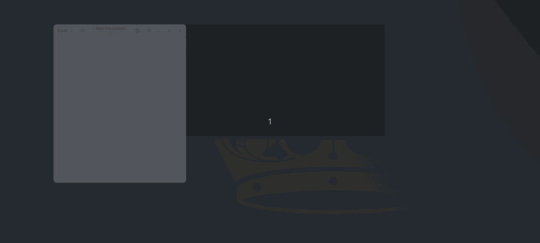

<p align="center">
  
</p>

<h1 align="center">camview</h1>

<p align="center">
  <strong>Borderless</strong> webcam for Linux screencasts and live streams:
  your camera in a clean window, with no title bar and no buttons, always on
  top of whatever you are recording.<br>
  As a circle, a rectangle, or a phone screen.
</p>

<p align="center">
  Python + GTK3 + GStreamer. No network, no account, no telemetry.
</p>

<p align="center">
  
</p>

## Why it exists

I am a Linux user and I do live streams. For a long time I used Cheese to
put my webcam on screen, and the same thing always bothered me: the control
bar sits there, taking up screen space and showing up in the recording.
There is no way to hide it.

So I decided to write my own. A window with **nothing but the image**, that
stays on top of what you are recording and gets out of the way. Since I was
building it anyway, I added what I had been missing:

- show the camera as a **circle**, a **rectangle**, with rounded corners, or
  as a **phone screen** (9:16 portrait);
- **resize it quickly** with the scroll wheel, `+`/`-`, presets or by
  dragging the edges, without opening any menu;
- switch camera, resolution, filters and lens settings (brightness, zoom,
  focus) while the video keeps running.

## Installing

### .deb (Debian, Ubuntu and derivatives)

Download the `.deb` from
[Releases](https://github.com/JorgeGzm/camview/releases) and install it with
apt, which pulls in GTK, GStreamer and v4l-utils for you:

```bash
sudo apt install ./camview_1.0.0_all.deb
```

You get the `camview` command and an entry in the applications menu.
To remove it: `sudo apt remove camview`.

### AppImage (any distribution)

A single executable file, nothing to install. Download it from
[Releases](https://github.com/JorgeGzm/camview/releases), make it
executable and run it. No pip, no venv, no sudo:

```bash
chmod +x camview-1.0.0-x86_64.AppImage
./camview-1.0.0-x86_64.AppImage --scale 0.35 --shape circle
```

### From source

```bash
git clone https://github.com/JorgeGzm/camview.git
cd camview
make setup     # checks system dependencies and creates the venv
make run       # run it
make install   # optional: installs the `camview` command and the menu icon
```

### System dependencies

On Ubuntu/Debian these are usually already installed:

```bash
sudo apt install python3-gi gir1.2-gtk-3.0 gir1.2-gstreamer-1.0 \
                 gir1.2-gst-plugins-base-1.0 gstreamer1.0-plugins-base \
                 gstreamer1.0-plugins-good v4l-utils
```

`make setup` checks every one of them and prints the exact command if any is
missing.

It needs an **X11** session: keeping the window on top and the rounded
outlines both rely on X11 features. On Wayland, run it through XWayland
(`GDK_BACKEND=x11`).

## Using it

```bash
camview --list                       # modes the camera supports
camview -w 640 -H 480 -f 30          # capture resolution and frame rate
camview --shape circle --scale 0.3   # a small circle, in the corner
camview --shape phone --scale 0.5    # 9:16 portrait, like a phone screen
camview --mirror --no-top            # mirrored, not always on top
```

### Shortcuts (with the window focused)

| Key | Action |
|---|---|
| drag with the mouse | move the window |
| drag the edges/corners | resize |
| scroll wheel, `+` / `-` | grow / shrink |
| `0` | original size |
| `1` `2` `3` `4` | snap to a corner (↖ ↗ ↙ ↘) |
| `m` | mirror horizontally |
| `t` | toggle "always on top" |
| `f` | fullscreen |
| `c` or right click | open settings |
| `q` / `Esc` | quit |

### Options

| Option | Description | Default |
|---|---|---|
| `-d, --device` | V4L2 device | `/dev/video0` |
| `-w, --width` / `-H, --height` | capture resolution | `1280x720` |
| `-f, --fps` | frames per second | `30` |
| `--format {mjpg,yuyv}` | camera format | `mjpg` |
| `--scale` | window scale relative to the capture | `1.0` |
| `--position {top-left,...}` | screen corner to open at | none |
| `--effect NAME` | image effect (e.g. `clarendon`, `lofi`, `inkwell`) | `normal` |
| `--shape {square,rounded,circle,phone}` | image outline | `square` |
| `--radius` | rounded corner radius in px; implies `--shape rounded` | `0` |
| `--mirror` | mirror horizontally | off |
| `--no-top` | do not keep the window on top | off |
| `--no-check` | skip validating the mode against the camera | off |
| `--list` | list the supported modes and exit | off |

## Settings (`c` key or right click)

- **Camera**: the device (every connected webcam shows up) and the mode
  (format / resolution / fps). "Apply" switches live, without closing the
  video.
- **Effects**: Instagram style filters (Clarendon, Juno, Lark, Aden,
  Valencia, 1977, Lo-Fi, Inkwell...) and fun ones (Retro, Edges, Ripple,
  Mosaic, X-Ray, Thermal). Color filters switch live; clicking the active
  filter goes back to Normal.
- **Image**: the **image outline** (square, rounded corners with an
  adjustable radius, circle or phone screen) and the camera's own controls,
  built from whatever it offers: brightness, contrast, saturation, 50/60 Hz
  anti-flicker, white balance, exposure, zoom, focus, pan/tilt. Everything
  applies immediately, with the video running.
- **Window**: window size (10% to 300%) with presets, and the **"always on
  top of the other windows"** checkbox, enabled by default.
- **About**: the versions of camview, Python, GTK, GStreamer and the system,
  with a button that copies it all for a bug report.

### The "phone screen" outline

The `phone` outline makes the window **portrait**, at 9:16, the same ratio
as stories and reels. It is not only the window that changes shape: the
image is cropped at the center (`videocrop`), so there are no black bars and
the scene is not lying on its side. Out of a 1280x720 capture, what reaches
the screen is the central 404x720 strip.

## Security

camview **does not use the network**: no connections, no server, no
telemetry. The only things it touches are `/dev/videoN` (through GStreamer)
and `v4l2-ctl` (to list modes and adjust the lens).

It runs fine under a sandbox (firejail, flatpak, snap). If the sandbox
blocks `v4l2-ctl`, video keeps working normally: only the "Image" tab and
the mode validation become unavailable, with a warning.

```bash
firejail --net=none --appimage ./camview-1.0.0-x86_64.AppImage
```

The device is restricted to `/dev/videoN` at the source and revalidated on
every external call; the pipeline is assembled with `ElementFactory`, where
values go in as properties and never as syntax (no `parse_launch`); V4L2
control names are checked against a regex; and the `appimagetool` used by
the build is a pinned release with a verified SHA-256.

## Development

```bash
make setup     # system dependencies + development venv
make run       # run it (ARGS="--scale 0.35 ..." to pass options)
make debug     # run with GStreamer logging enabled
make test      # tests (pytest), no camera and no display needed
make lint      # static analysis (ruff)
make build     # build the wheel into dist/
make appimage  # build the AppImage into releases/
make deb       # build the .deb into releases/
make install   # install through pipx + menu icon
make delete    # uninstall
make clean     # remove venv, dist/ and caches
```

The same tasks are available in VSCode (`Terminal → Run Task…`), and F5
debugs camview with breakpoints (`.vscode/launch.json`).

### How the code is organized

An `src/` layout, with a strict split between pure logic (testable with no
graphical environment) and the GTK/GStreamer layer:

```
src/camview/
├── config.py    immutable Value Objects (CaptureConfig, WindowConfig)
├── geometry.py  pure functions for window position, size and crop
├── pipeline.py  Strategy per camera format + GStreamer pipeline Builder
├── camera.py    Facade over v4l2-ctl: devices and modes
├── controls.py  Facade over v4l2-ctl: brightness, zoom, focus...
├── effects.py   effect catalog
├── about.py     program and environment versions
├── cli.py       arguments → validated configuration
├── settings.py  settings window (GTK)
├── window.py    the View: the only layer that touches GTK/GStreamer
└── assets/      SVG icon and .desktop entry
tests/           unit tests, no camera and no display
```

Only `window.py` and `settings.py` import GTK; everything else is pure
Python, which is why the suite runs on any machine, CI included.

## Contributing

Issues and pull requests are welcome. Before opening a PR, run:

```bash
make lint && make test
```

## License

[MIT](LICENSE). © 2026 Jorge Guzman.
